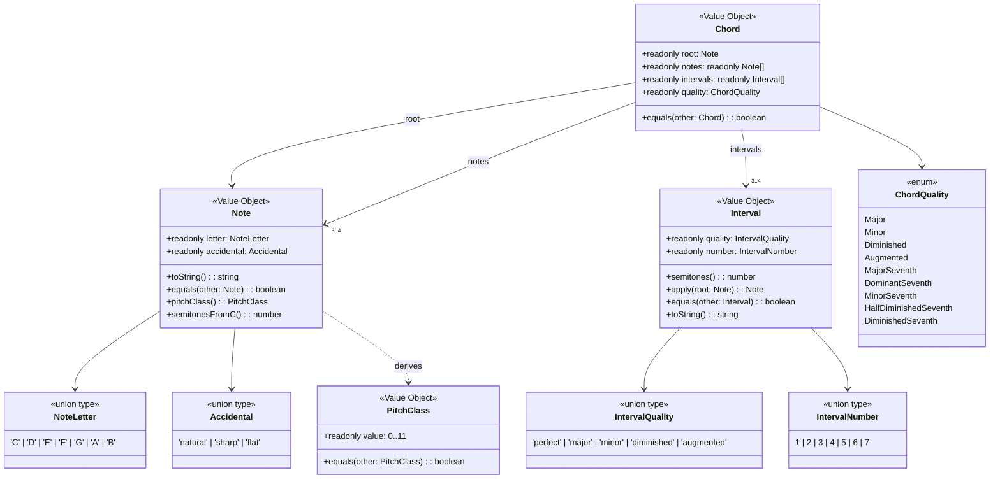

# Data Model: Análisis de Acorde Individual

**Feature**: 001-chord-analysis | **Date**: 2026-06-07

## Entity Diagram



## Entities

### Note (Value Object)

| Field | Type | Constraints | Validation |
|-------|------|-------------|------------|
| `letter` | `NoteLetter` | `'C' \| 'D' \| 'E' \| 'F' \| 'G' \| 'A' \| 'B'` | Must be one of 7 valid letters |
| `accidental` | `Accidental` | `'natural' \| 'sharp' \| 'flat'` | Must be one of 3 valid states |

**Invariants**:
- Immutable: `readonly` fields + `Object.freeze` at construction.
- Self-validating: constructor throws `InvalidNoteError` for invalid inputs.
- Equality by value: `Note('C', 'sharp').equals(Note('C', 'sharp'))` → `true`.

**Derived behavior**:
- `toString()`: `"C"`, `"F#"`, `"Bb"` — for display/debugging, NOT for domain logic.
- `pitchClass()`: Returns a `PitchClass` (0–11) derived from letter + accidental.
- `semitonesFromC()`: Integer distance from C natural, used by Interval arithmetic.

---

### PitchClass (Value Object)

| Field | Type | Constraints | Validation |
|-------|------|-------------|------------|
| `value` | `number` | Integer 0–11 | Must be integer in range [0, 11] |

**Invariants**:
- Immutable.
- Self-validating.
- C=0, C#/Db=1, D=2, ..., B=11.
- Equality by value.

> **Note**: PitchClass is a derived concept. Notes are NOT constructed from PitchClass — PitchClass is computed from Note when needed (e.g., for enharmonic comparisons).

---

### Interval (Value Object)

| Field | Type | Constraints | Validation |
|-------|------|-------------|------------|
| `quality` | `IntervalQuality` | `'perfect' \| 'major' \| 'minor' \| 'diminished' \| 'augmented'` | Must be valid for the interval number |
| `number` | `IntervalNumber` | `1 \| 2 \| 3 \| 4 \| 5 \| 6 \| 7` | Must be integer 1–7 |

**Invariants**:
- Immutable, self-validating.
- Quality must be valid for the number: intervals 1, 4, 5 accept `perfect/diminished/augmented`; intervals 2, 3, 6, 7 accept `major/minor/diminished/augmented`.
- Constructor throws `InvalidIntervalError` for invalid quality+number combinations.

**Derived behavior**:
- `semitones()`: Returns the interval size in semitones.
- `apply(root: Note): Note`: Computes the resulting note when this interval is applied above the given root, with correct enharmonic spelling.
- `toString()`: e.g., `"major 3rd"`, `"diminished 5th"`, `"perfect unison"`.

**Semitone table** (for `semitones()` computation):

| Interval | Semitones |
|----------|-----------|
| P1 (perfect unison) | 0 |
| m2 | 1 |
| M2 | 2 |
| m3 | 3 |
| M3 | 4 |
| P4 | 5 |
| d5 | 6 |
| P5 | 7 |
| A5 | 8 |
| m6 / d7 | 8 / 9 |
| M6 | 9 |
| m7 | 10 |
| M7 | 11 |
| d7 | 9 |

> Nota: d7 = 9 semitonos, m7 = 10, M7 = 11.

---

### ChordQuality (Enum/Union Type)

```typescript
type ChordQuality =
  | 'major'
  | 'minor'
  | 'diminished'
  | 'augmented'
  | 'major-seventh'
  | 'dominant-seventh'
  | 'minor-seventh'
  | 'half-diminished-seventh'
  | 'diminished-seventh';
```

**Interval templates** per quality:

| Quality | Intervals |
|---------|-----------|
| `major` | P1, M3, P5 |
| `minor` | P1, m3, P5 |
| `diminished` | P1, m3, d5 |
| `augmented` | P1, M3, A5 |
| `major-seventh` | P1, M3, P5, M7 |
| `dominant-seventh` | P1, M3, P5, m7 |
| `minor-seventh` | P1, m3, P5, m7 |
| `half-diminished-seventh` | P1, m3, d5, m7 |
| `diminished-seventh` | P1, m3, d5, d7 |

---

### Chord (Value Object)

| Field | Type | Constraints | Validation |
|-------|------|-------------|------------|
| `root` | `Note` | Valid Note | Must be a valid Note instance |
| `notes` | `readonly Note[]` | 3 (triad) or 4 (seventh) | Length must match quality type |
| `intervals` | `readonly Interval[]` | 3 or 4 | Must match quality template exactly |
| `quality` | `ChordQuality` | One of 9 valid qualities | Must match interval template |

**Invariants**:
- Immutable: all fields `readonly`, arrays `readonly`, `Object.freeze` deeply.
- Self-validating: constructor verifies `notes` match the application of `intervals` to `root`.
- `notes[0]` is always the root.
- Equality by value: two chords are equal if root, quality, and all notes are equal.

**Construction**: A `Chord` is built from a `root: Note` and `quality: ChordQuality`. The constructor:
1. Looks up the interval template for the quality.
2. Applies each interval to the root to compute the notes.
3. Freezes everything.

There is no way to construct a `Chord` with arbitrary notes — the notes are always derived from root + quality. This guarantees correctness by construction.

---

## Adapter: ChordSymbolParser

> **NOT an entity** — lives in `src/harmonic-analysis/adapters/`.

**Input**: `string` (chord symbol, e.g., `"Dm7"`, `"F#m7b5"`, `"Caug"`)

**Output**: `{ root: Note, quality: ChordQuality }` or throws `InvalidChordSymbolError`

**Parsing rules** (FR-004, FR-005, FR-011, FR-012):

1. Trim whitespace (FR-009).
2. Extract root: first character must be `[A-G]` (uppercase, FR-012), optionally followed by `#` or `b`.
3. Match remaining suffix against canonical table:

| Suffix | Quality |
|--------|---------|
| `""` | major |
| `"m"` | minor |
| `"dim"` | diminished |
| `"aug"` or `"+"` | augmented |
| `"maj7"` or `"M7"` | major-seventh |
| `"7"` | dominant-seventh |
| `"m7"` | minor-seventh |
| `"m7b5"` | half-diminished-seventh |
| `"dim7"` | diminished-seventh |

4. If suffix doesn't match any → `InvalidChordSymbolError`.
5. If characters remain after root + suffix → `InvalidChordSymbolError`.

---

## Error Types

| Error | When | Message Pattern |
|-------|------|-----------------|
| `InvalidNoteError` | Invalid letter or accidental in Note constructor | `"Invalid note: {input}"` |
| `InvalidIntervalError` | Invalid quality+number combination | `"Invalid interval: {quality} {number}"` |
| `InvalidChordSymbolError` | Malformed or unrecognized chord symbol | `"Invalid chord symbol: {symbol}. {reason}"` |

All error types extend a base `HarmonyError` class for catch-all handling.
